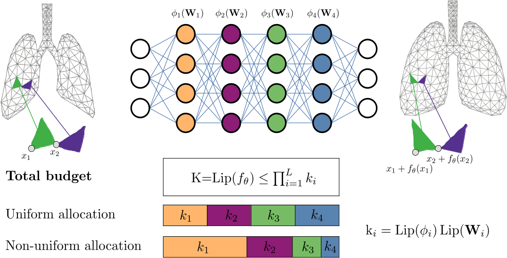

## [ICLR'26] :sparkles: Beyond Uniformity: Regularizing Implicit Neural Representations through a Lipschitz Lens 🔎
[[Paper]](https://openreview.net/pdf?id=REEdaR0zqj) [[Project Page]](https://lipschitz-inrs.github.io)

---

### Abstract

Implicit Neural Representations (INRs) have shown great promise in solving inverse problems, but their lack of inherent regularization often leads to a trade-off between expressiveness and smoothness. While Lipschitz continuity presents a principled form of implicit regularization, it is often applied as a rigid, uniform 1-Lipschitz constraint, limiting its potential in inverse problems. In this work, we reframe Lipschitz regularization as a flexible *Lipschitz budget framework*. We propose a method to first derive a principled, task-specific total budget *K*, then proceed to distribute this budget *non-uniformly* across all network components, including linear weights, activations, and embeddings. Across extensive experiments on deformable registration and image inpainting, we show that non-uniform allocation strategies provide a measure to balance regularization and expressiveness within the specified global budget. Our *Lipschitz lens* introduces an alternative, interpretable perspective to Neural Tangent Kernel (NTK) and Fourier analysis frameworks in INRs, offering practitioners actionable principles for improving network architecture and performance.



> **Google Colab demo coming soon.** We are working on an easy-to-run notebook — watch this repo or check the project page for updates.

### Experiments

**Experiment 1 — Effect of Layers and Activation on SDF**
```
cd sdf_inpainting_experiment
python3 train_sdf_obj.py  # set shape and model specs as needed
```

**Experiment 2 — Lipschitz Budget Allocation on SDF**
```
cd sdf_inpainting_experiment
python3 train_sdf_obj.py  # set shape and model specs as needed
```

**Experiment 3 — Lipschitz Budget Allocation on Inpainting**
```
cd sdf_inpainting_experiment
python3 constrained_inpainting.py  # set image and model specs as needed
```

**Experiment 4 — Lipschitz Budget Allocation on Registration**
```
cd registration_experiment
python3 run.py  # set volume and model specs as needed
```

**Experiment 5 — Lipschitz Perspective on Scaling of Initialization**
```
cd scaling_experiment
python3 run_scaling.py  # set image and model specs as needed
```

---
### Data and Reproducability

We provide exemplary data for the shape and CelebA experiments in 'data'. Additional shapes can be downloaded from [here](https://github.com/alecjacobson/common-3d-test-models). Note that not all meshes are watertight; we only used: `armadillo`, `beast`, `bimba`, `cow`, `homer`, `ogre`, `spot`, `stanford-bunny`, `suzanne`, `teapot`.


#### Images (CelebA)
Download from [Kaggle](https://www.kaggle.com/datasets/jessicali9530/celeba-dataset). Data location: `./data/celeba/`

Images used for **inpainting** experiments:
```
000153.jpg  000154.jpg  000155.jpg  000156.jpg  000157.jpg
000158.jpg  000159.jpg  000160.jpg  000161.jpg  000162.jpg
000163.jpg  000164.jpg  000165.jpg  000166.jpg  000167.jpg
000168.jpg  000169.jpg  000170.jpg  000171.jpg  000172.jpg
```

Images used for **scaling of initialization** experiments:
```
050812.jpg  050813.jpg  050814.jpg  050815.jpg  050816.jpg
050817.jpg  050818.jpg  050819.jpg  050820.jpg  050821.jpg
```

#### Medical Registration (IDIR)
Please register for data access [here](https://med.emory.edu/departments/radiation-oncology/research-laboratories/deformable-image-registration/index.html). Data location: `./data/IDIR/`

For mask generation, follow the instructions in [this issue](https://github.com/MIAGroupUT/IDIR/issues/9). We reuse the file structure of the [official repo](https://github.com/MIAGroupUT/IDIR) and use all 10 cases.

---
### Citation

```bibtex
@inproceedings{mcginnis2026beyond,
  title     = {Beyond Uniformity: Regularizing Implicit Neural Representations through a Lipschitz Lens},
  author    = {McGinnis, Julian and Shit, Suprosanna and H{\"o}lzl, Florian A. and Friedrich, Paul and B{\"u}schl, Paul and Sideri-Lampretsa, Vasiliki and M{\"u}hlau, Mark and Cattin, Philippe C. and Menze, Bjoern and Rueckert, Daniel and Wiestler, Benedikt},
  booktitle = {International Conference on Learning Representations},
  year      = {2026}
}
```
